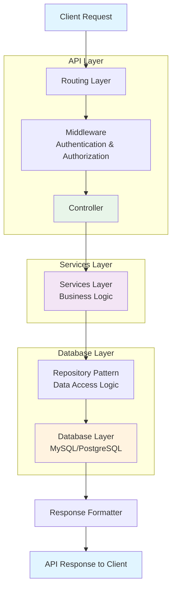

# Backend Laravel for Loyola

## Backend Implementation Flow

The backend implementation follows a structured and organized approach to ensure maintainability, scalability, and reliability. The flow begins with incoming requests that are processed through the routing layer, which directs them to the appropriate controller. Controllers handle business logic and coordinate with services to perform operations. Services contain the core business logic and interact with repositories, which provide an abstraction layer for database operations. The repository pattern ensures that database queries are centralized and can be easily tested and modified. Once the service layer processes the request and retrieves or manipulates data through repositories, the response is formatted and returned to the client. Error handling is implemented throughout the flow to catch and manage exceptions gracefully. Middleware components are applied before requests reach controllers to handle authentication, authorization, and other cross-cutting concerns. The entire process is designed to maintain separation of concerns, making the codebase modular and easier to maintain.

## Backend Development Flowchart

## Features

- RESTful API design
- Laravel best practices
- Service-oriented architecture
- Repository pattern for data access
- Comprehensive error handling
- Authentication and authorization
- Request validation
- Database migrations and seeding

## Requirements

- PHP 8.0 or higher
- Laravel 9.0 or higher
- MySQL 5.7+ or PostgreSQL 10+
- Composer

## Installation

1. Clone the repository
2. Install dependencies: `composer install`
3. Copy `.env.example` to `.env` and configure your database
4. Generate application key: `php artisan key:generate`
5. Run migrations: `php artisan migrate`
6. Start the development server: `php artisan serve`

## License

This project is open source and available under the MIT License.
